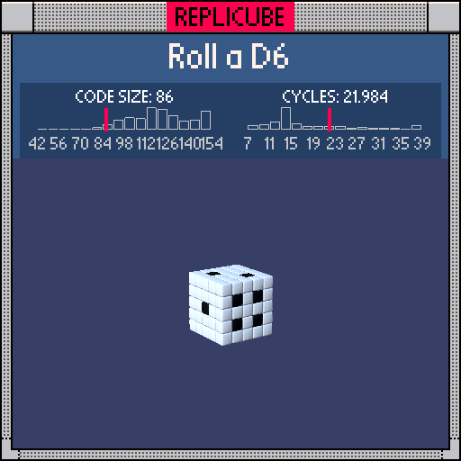

# Roll a D6

> A roguelike where dice are your only weapon? I'd play that (‾◡◝)



| Grid | Code Size | Leaderboard | Cycles | Leaderboard | Date |
|:----:|:---------:|:-----------:|:------:|:-----------:|:----:|
| 5x5x5 | **86** | #43 | **21.984** | #986 | 2026-02-24 |

## Solution

```lua
a=abs(x)
b=abs(y)
return(z==2 and(x|y)==0 or z==-2 and a==1 and b<2 or b==2 and x*z==-1 or y==-2 and a==abs(z)and a<2 or x==-2 and y==z and b<2 or x==2 and b*abs(z)==1)and 3 or 1
```

## How it works

It's a solid WHITE cube where BLACK pips are placed on each face. The whole thing is one big `return` with six `or`-chained conditions, one per face, feeding into `and 3 or 1` at the end.

Each face has its own pip pattern: the **1-face** (z=2) uses `(x|y)==0` to check both coords are zero (our bitwise OR trick). The **6-face** (z=-2) is a 2x3 grid of pips. The **2-face** (y=2) uses `x*z==-1`, a product trick that catches exactly the anti-diagonal pair. The **5-face** has center + corners, the **3-face** has a main diagonal, and the **4-face** checks for all four corners with `b*abs(z)==1`.

Opposite faces always sum to 7, just like a real die!
