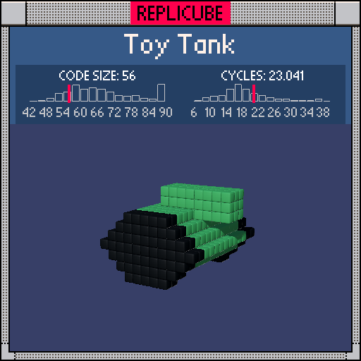

# Toy Tank

> Tactical turn-based RPG but it's WW2? Just build the tank first, buddy ┐(︶▽︶)┌



| Grid | Code Size | Leaderboard | Cycles | Leaderboard | Date |
|:----:|:---------:|:-----------:|:------:|:-----------:|:----:|
| 13x13x13 | **56** | #187 | **23.041** | #902 | 2026-02-24 |

## Solution

```lua
b=abs(z)
if max(b,abs(y-4))<2 and x>-2 or abs(y)+abs(x)<6 and abs(y)<4 and(b>4 or y>-2)then return b<5 and 11 or 3 end
```

## How it works

The tank is two pieces: a chunky diamond-shaped hull and a little turret sitting on top.

The **hull** is a diamond in the x-y plane (`abs(y)+abs(x)<6`) capped at 4 units tall (`abs(y)<4`). The undercarriage gets carved out where the belly would be (`abs(z)<5 and y<-1`), leaving the wide tracks poking out on both sides. Those track edges (`abs(z)>4`) get painted BLACK while everything else is GREEN.

The **turret** is a compact cube centered at y=4, using `max(abs(z), abs(y-4))<2` as a clean Chebyshev distance check. It extends from x=-1 onward (`x>-2`), giving the barrel a slight forward lean.

The whole thing fits in one `if` statement by `or`-ing turret and body together, with a shared color expression at the end.
