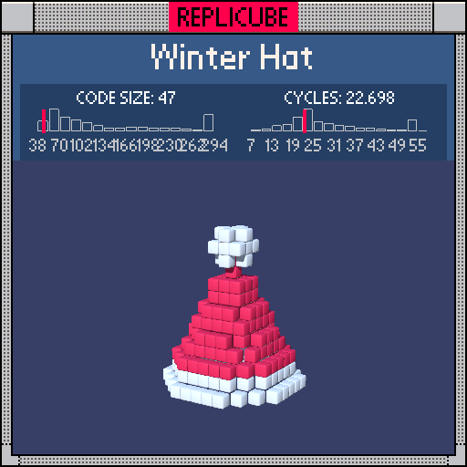

# Winter Hat

> A sorting hat for magical flying reindeer, in 47 tokens ✧



| Grid | Code Size | Leaderboard | Cycles | Leaderboard | Date |
|:----:|:---------:|:-----------:|:------:|:-----------:|:----:|
| 13x13x13 | **47** | #52 | **22.698** | #387 | 2026-02-24 |

## Solution

```lua
d=x*x+z*z
return floor(sqrt(d)-(3-y)/2)==0 and(y>-5 and 7 or 1)or d+(y-5)*(y-5)<3
```

## How it works

A cone + a pompom.

The **cone** is a ring at each y level. `sqrt(d) - (3-y)/2` computes how far each voxel is from the target radius, which shrinks as y goes up. `floor(...)==0` keeps only voxels within one unit of that radius, giving the hollow cone shape. The bottom two rings (y=-6,-5) are WHITE for the brim, everything above is RED.

The **pompom** is just a small sphere at the top: `d+(y-5)*(y-5)<3` catches everything within radius ~1.4 of (0,5,0). It returns bare `true` = WHITE for free!
