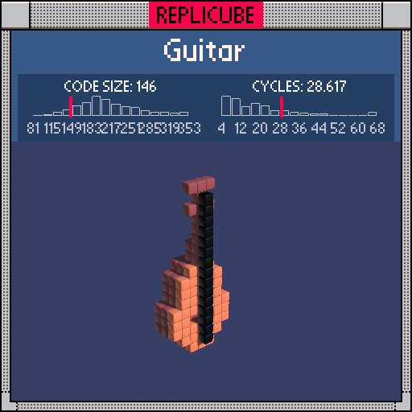

# Guitar

> Flansburg would approve. Probably. Maybe. Let's not ask him (´∀`)



| Grid | Code Size | Leaderboard | Cycles | Leaderboard | Date |
|:----:|:---------:|:-----------:|:------:|:-----------:|:----:|
| 17x17x17 | **146** | #65 | **28.617** | #609 | 2026-02-24 |

## Solution

```lua
e=sqrt((y+5)^2+x*x)
d=ceil(min(sqrt((y+2)^2+x*x)-.8,e-1.5))
if d<3 then
if z==-3 or d>1 and z==-2 then return 15 end
if z==-1 and e>1 then return 8 end
end
if x==0 then
if z==0 and abs(y)<8 then return 3 end
if y>-1 and y<6 and z<0 and y-3*z<9 then return 15 end
end
if y>5 and abs(x)<2 and z==-1 and(y%2<1 or x==0)then return 15 end
```

## How it works

The guitar is built from four pieces: a double-lobed body, a neck, tuning pegs, and a string.

The **body** is shaped by two overlapping circles in the x-y plane, one centered at y=-2 (radius ~0.8) and one at y=-5 (radius ~1.5), like a classic acoustic guitar figure-eight. `ceil(min(...))` merges both distance fields into a single boundary check. The body is three layers deep: a BROWN back at z=-3, BROWN rim at z=-2 (only the outer ring where `d>1`), and an ORANGE face at z=-1. The sound hole is carved out of the face where `e<=1`, right at the center of the lower bout.

The **neck** runs along x=0 from y=0 up to y=5, extending backward in z with a diagonal cutoff (`y-3*z<9`) that gives it a tapered profile as it meets the body.

The **tuning pegs** stick out at the headstock (y>5) as little nubs at x=-1 and x=1 on even y values, plus the center line at x=0. All BROWN to match the neck.

The **string** is a single BLACK line down x=0, z=0, spanning almost the full grid height.
