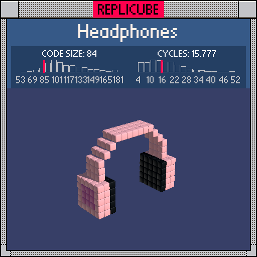

# Headphones

> The whole thing fits in two `if` statements. One for the cups, one for the band. Minimalist design for a minimalist solution ┗(＾0＾)┓



| Grid | Code Size | Leaderboard | Cycles | Leaderboard | Date |
|:----:|:---------:|:-----------:|:------:|:-----------:|:----:|
| 17x17x17 | **84** | #83 | **15.777** | #415 | 2026-02-24 |

## Solution

```lua
a=abs(x)
b=abs(z)
if b<3 and y>-5 and y<1 and a>4 and a<8 then
return a<6 and 3 or a>6 and b<2 and y<0 and y>-4 and 5 or 4
end
if b<2 and y>-1 and max(y,a,a+y-3)==6 then return 4 end
```

## How it works

Two parts: the ear cups and the headband.

The **ear cups** are symmetric boxes at `abs(x)` between 5 and 7, spanning y from -4 to 0 and three voxels deep in z. A single ternary chain handles all three layers: the innermost face (`a<6`) is BLACK for the speaker grille, the outermost face (`a>6`) gets a PINK cushion in the center (where both z and y are close to the middle), and everything else is PEACH plastic.

The **headband** arcs over the top using `max(y, a, a+y-3)==6`, which is a neat trick. It defines a chamfered shape: a flat top at y=6, vertical sides at a=6, and 45-degree bevels where the band curves down to meet the cups. The `==6` makes it a thin shell rather than a solid block, just one voxel thick all around the arc.
