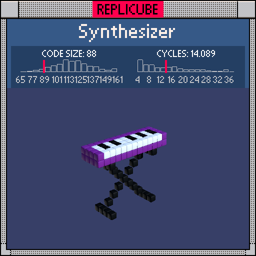

# Synthesizer

> Eighty-eight keys on a real piano, eighty-eight tokens in our solution. Coincidence? Absolutely. But still cool ╰(▔∀▔)╯



| Grid | Code Size | Leaderboard | Cycles | Leaderboard | Date |
|:----:|:---------:|:-----------:|:------:|:-----------:|:----:|
| 13x13x13 | **88** | #66 | **14.089** | #565 | 2026-02-24 |

## Solution

```lua
a=abs(x)
b=abs(y+2)
if z>-3 and z<2 then
if a<6 and y==4 and z>-2 then
if z<1 and(x+btoi(x>-1))%2<1 then return 3 end
return 1
end
if y>2 and y<5 then return 6 end
if(z==-1 or b==4)and a==b then return 3 end
end
```

## How it works

The synth has three parts: the keys, the purple body, and the stand underneath.

The **keys** sit at y=4 in a thin slab. Every key starts WHITE, then certain ones get painted BLACK to make the sharps. The trick is `(x+btoi(x>-1))%2` which creates an alternating pattern that skips correctly at x=0, just like a real keyboard where there's no sharp between E and F. The black keys only render on the back half (`z<1`) so they sit raised behind the white ones.

The **body** is a purple block at y=3 and y=4 that extends slightly deeper in z, wrapping around and behind the keys like a synth casing.

The **stand** uses `abs(y+2)` to define four diagonal legs meeting at a center rail. The legs appear where `abs(x)==abs(y+2)`, forming an X-shape in the x-y plane. The bottom rail at z=-1 connects everything together, and the top rail at `abs(y+2)==4` (y=2) forms the horizontal support right under the body.
