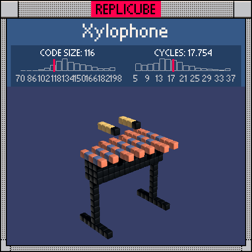

# Xylophone

> Turn around, turn around, there's a thing there that can be found ♪(๑ᴖ◡ᴖ๑)♪



| Grid | Code Size | Leaderboard | Cycles | Leaderboard | Date |
|:----:|:---------:|:-----------:|:------:|:-----------:|:----:|
| 17x17x17 | **116** | #109 | **17.754** | #494 | 2026-02-24 |

## Solution

```lua
a=abs(x)
b=abs(z)
if y==3 and a<8 and x%2<1 and b<(x+9)//6+3 then
return b~=1 and 8 or 2
end
if y>-1 and y<3 and a<7 and b<2 then return 3 end
if a==6 and y<0 and(z==0 or y==-8 and b<4)then return 3 end
if a==2 and y==6 and z>-4 and z<1 then return z~=0 and 9 or 3 end
```

## How it works

Four pieces: the bars, the frame, the legs, and the mallets.

The **bars** sit at y=3 across every even x position. Each bar gets wider as x increases, controlled by `(x+9)//6+3` which steps the half-width from 3 up to 5 in groups of three. This gives the classic xylophone taper from short high notes to long low notes. The edge voxels (`abs(z)==1`) are painted GREY for a metallic rim, with ORANGE fill everywhere else.

The **frame** is a BLACK rail running along both sides at `abs(x)<7`, sitting just below the bars at y=0 through y=2, only one voxel wide in z.

The **legs** drop straight down from x=+-6, a single BLACK post at z=0 all the way to the bottom, where they spread into a flat BLACK foot at y=-8.

The **mallets** are two little sticks at x=+-2, y=6, extending back in z. The tip at z=0 is BLACK for the handle, and the head behind it is YELLOW.
