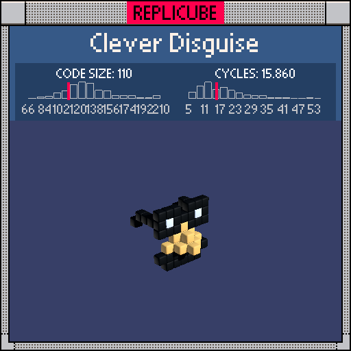

# Clever Disguise

> Nobody will recognize you with these on. Guaranteed. Probably. Don't sue us (¬‿¬ )



| Grid | Code Size | Leaderboard | Cycles | Leaderboard | Date |
|:----:|:---------:|:-----------:|:------:|:-----------:|:----:|
| 7x7x7 | **110** | #143 | **15.860** | #354 | 2026-02-24 |

## Solution

```lua
a=abs(x)
if y<-1 and z==1 and a*y>-9 then return 3 end
if z>0 and y>-2 and z+y+a<3 then return 9 end
if z==1 then
d=max(abs(a-2),abs(y-2))
if d<1 then return 1 end
if d<2 or y==2 and x==0 then return 3 end
end
if a==3 and z<2 and y+step(-2,z)==2 then return 3 end
```

## How it works

Classic Groucho Marx disguise: big glasses, a nose, and a mustache. Four layers rendered in priority order.

The **mustache** comes first since it overrides everything below the glasses. It's a BLACK slab at z=1 covering y<-1, with the bottom corners carved out using `a*y>-9`, a neat trick that excludes only the exact point where `abs(x)==3` and `y==-3`.

The **nose** is a YELLOW wedge defined by `z+y+a<3`, a tetrahedron that pokes forward from the face. It sits above y=-2 and only exists at z>0.

The **glasses** live on the z=1 plane. The lenses are two Chebyshev-distance circles centered at x=+-2, y=2. The distance `max(abs(abs(x)-2), abs(y-2))` measures how far you are from the nearest lens center. Distance 0 is the WHITE eye, distance 1 is the BLACK frame, and x=0,y=2 adds the nose bridge connecting them.

The **temple arms** extend backward from x=+-3, angling down slightly: y=2 near the face, dropping to y=1 at the very back (z=-3).
